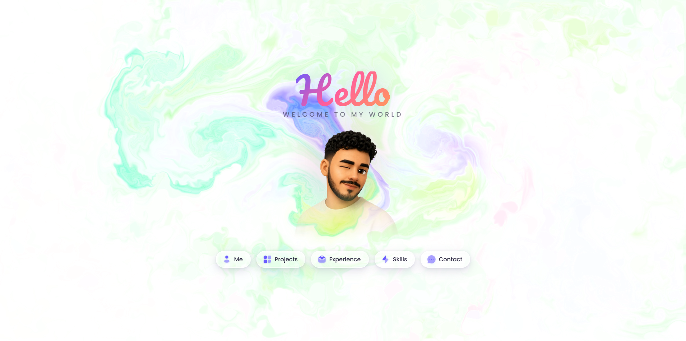

<p align="center">
  
</p>

<h1 align="center">Youssef Talibi — Portfolio</h1>

<p align="center">
  An interactive, animated personal portfolio built with React & Vite —<br/>
  featuring a WebGL fluid cursor, glassmorphic panels, and buttery motion.
</p>

<p align="center">
  
  
  
  
</p>

---

## ✨ Overview

A single-page portfolio where the hero and each section swap in place with smooth
enter/exit transitions. An interactive **WebGL fluid** follows the cursor in the
background — a real-time GPU fluid solver (advection, vorticity, pressure/Jacobi
iterations) — while the foreground is composed of frosted-glass panels navigated
through a glass pill menu.

Move the mouse to stir the fluid; click to burst a splat. Works on touch too.

## 🧭 Sections

| Section | What's inside |
|---|---|
| **Me** | Bio, live-updating stats (age, years of experience, degrees), skills & education |
| **Projects** | Featured public projects + a locked grid of confidential (NDA) company work |
| **Experience** | An animated timeline of roles, internships and companies |
| **Skills** | A 40+ tile tech-stack grid with real brand icons |
| **Contact** | LinkedIn, GitHub and email cards |

## 🛠️ Built With

- **[React 18](https://react.dev/)** + **[Vite 5](https://vitejs.dev/)** — app & build tooling
- **[Framer Motion](https://www.framer.com/motion/)** — page and element animations
- **[GSAP](https://gsap.com/)** — staggered reveals
- **[Iconify](https://iconify.design/)** (`@iconify/react`) — Solar duotone & brand logos
- **WebGL fluid simulation** — the cursor-reactive background

## 🚀 Getting Started

```bash
# 1. Install dependencies
npm install

# 2. Start the dev server
npm run dev

# 3. Build for production
npm run build

# 4. Preview the production build
npm run preview
```

The dev server runs on the default Vite port (**http://localhost:5173**).

## 📁 Project Structure

```
YT/
├── public/                 # Static assets (images, projects, experience, favicon)
│   └── portfolio.png       # Portfolio preview (README header)
├── src/
│   ├── App.jsx             # Root — hero, nav & panel switching
│   ├── FluidCursor.jsx     # WebGL fluid background
│   ├── MePanel.jsx         # About / bio / stats
│   ├── ProjectsPanel.jsx   # Featured + private projects
│   ├── ExperiencePanel.jsx # Animated experience timeline
│   ├── SkillsPanel.jsx     # Tech-stack grid
│   ├── ContactPanel.jsx    # Contact cards
│   └── *.css               # Per-panel styles
└── index.html
```

## 🌊 How the fluid works

- `src/FluidCursor.jsx` — the whole simulation: WebGL2 (with WebGL1 fallback),
  half-float render targets, and shader passes for curl, vorticity confinement,
  divergence, pressure solve, gradient subtraction, and advection.
- The display shader outputs an alpha equal to the dye intensity, so empty areas
  stay transparent and the page background shows through.
- Fluid solver adapted from Pavel Dobryakov's
  [WebGL-Fluid-Simulation](https://github.com/PavelDoGreat/WebGL-Fluid-Simulation) (MIT).

## 📬 Contact

- **LinkedIn** — [youssef-talibi--fs](https://www.linkedin.com/in/youssef-talibi--fs/)
- **GitHub** — [youce-etalibi](https://github.com/youce-etalibi)
- **Email** — [youssef.talibi11@gmail.com](mailto:youssef.talibi11@gmail.com)

---

<p align="center">Made with ❤️ by <strong>Youssef Talibi</strong> — Software Developer, Morocco 🇲🇦</p>
